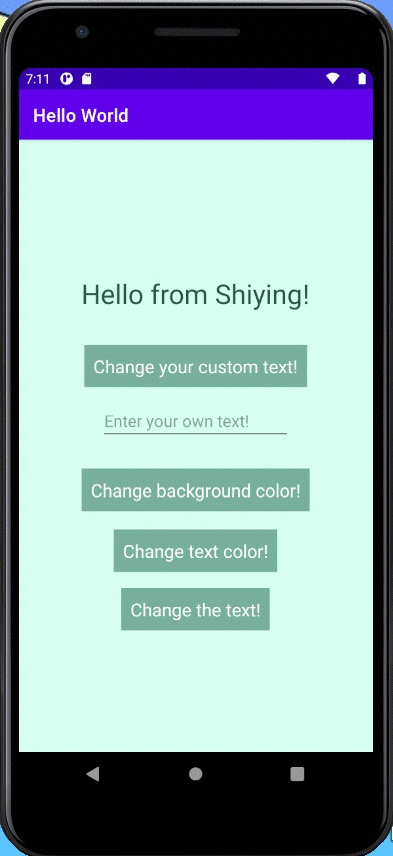

# Hello World App - pre-work

This is a simple Android App where users can change the text color, background color, change the text content, as well as entering their own text.

### App Walk-though
User can change the text color:
 

User can change the background color:
 

User can change the text:
 

User can enter their custom text:
 

User can tap on the background view to reset all views to default settings:
 

### Required User Stories
- [x] 1. User sees custom text in a label - Hello from {name}!
- [x] 2. User see's custom background color.
- [x] 3. User can tap a button to change the text color of the label.

### Optional User Stories
- [x] 1. User can tap a button to change the color of the background view.  
- [x] 2. User can tap a button to change the text string of the label - Android is Awesome!  
- [x] 3. User can tap on the background view to reset all views to default settings.  
- [x] 4. User can update the label text with custom text entered into the text field.  
   - [x] a. User can enter text into a text field using the keyboard.  
   - [x] b. User can tap the "Change text string" button to update the label with the text from the text field.  
   - [x] c. If the text field is empty, update label with default text string.  
